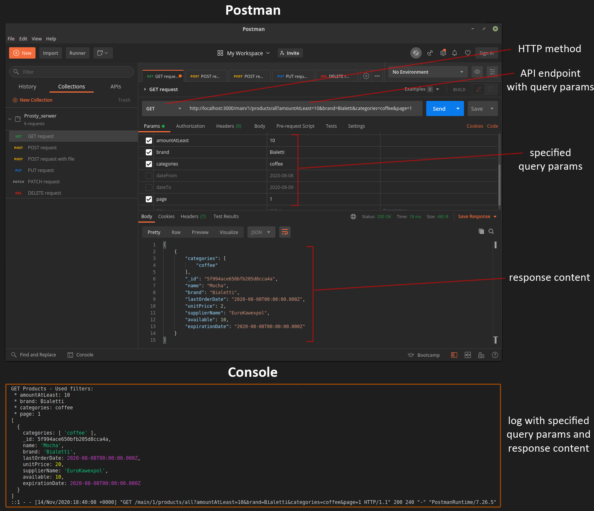

# Coffee shop management system (Workshop-4, Node.js)

A server app (back-end app) being an API that may serve for management of a small coffee shop. You can interact with API endpoints using `Postman` (3rd party app). The project is the part of the Coders Lab course.

The figure below shows an example of the interaction to find products with applied query params. All available interactions are listed in the 'Endpoints' section.



# Endpoints
* Endpoints correspond to database collections (see the 'MongoDB' section):
  * http://localhost:3000/main/1/orders
  * http://localhost:3000/main/1/products
  * http://localhost:3000/main/1/staff
* If an endpoint handles query params (see subsections below), it is not necessary to provide all of them.
* To add a new order, product or employee to the database, a request body need to satisfy the respective Mongoose model (see the 'Mongoose models' section).

## Orders endpoints
* **GET**
  * **/all** - find all orders
  * **/all?dateFrom&dateTo&page** - find orders with applied query params, *e.g.*:
    * dateFrom=2020-11-13
    * dateTo=2020-11-14
    * page=1
  * **/:id** - find an order by ID
* **POST**
  * **/** - add a new order using data from a request body
* **PUT**
  * **/:id** - update an order found by ID using data from a request body
* **DELETE**
  * **/:id** - delete an order found by ID

## Products endpoints
* **GET**
  * **/all** - find all products
  * **/all?amountAtLeast&brand&categories&page** - find products with applied query params, *e.g.*:
    * amountAtLeast=10
    * brand=Bialetti
    * categories=coffee,food
    * page=1
  * **/:id** - find a product by ID
* **POST**
  * **/** - add a new product using data from a request body
* **PUT**
  * **/:id** - update a product found by ID using data from a request body
* **DELETE**
  * **/:id** - delete a product found by ID

## Staff endpoints
* **GET**
  * **/all** - find all employees
  * **/all?ratingAbove&ratingBelow&position&page** - find employees with applied query params, *e.g.*:
    * ratingAbove=3
    * ratingBelow=5
    * position=waitress,waiter
    * page=1
  * **/:id** - find an employee by ID
* **POST**
  * **/** - add a new employee using data from a request body
* **PUT**
  * **/:id** - update an employee found by ID using data from a request body
* **DELETE**
  * **/:id** - delete an employee found by ID

# MongoDB
* Database address:
  * `mongodb://localhost:27017/coffeeShop`
* Database name:
  * `coffeeShop`
* Collections names:
  * `orders`
  * `products`
  * `staff`

## Mongoose models
* In each model, all listed fields are required (unless otherwise stated).
* Additionally, the order model:
  * checks if indicated employee exists
  * checks if indicated products exist
  * updates amount of indicated products:
    * product(s) amount is being decreased when the order is added
    * product(s) amount is being decreased and/or increased when the order is updated
    * product(s) amount is being increased when the order is deleted.
  * contains `total` field being a calculated result.

### Order model
* **date** - `Date` - *e.g.* `2020-11-14`
* **location** - `String`
* **paidIn** - `String` - available options: `cash`, `card`
* **staffId** - `String` - ID (*e.g.* `5f992b9124f092144cc2142a`) referred to existing employee from `staff` collection
* **products** - `Array` of objects - every product (object) includes:
  * **_id** - `String` - ID (*e.g.* `5f9d85530229214256c56e70`) referred to existing product from `products` collection
  * **name** - `String`
  * **amount** - `Number` - greater than `0`
  * **unitPrice** - `Number`
* **total** - *Do not provide it*. This field is a calculated result.

### Product model
* **name** - `String`
* **brand** - `String`
* **lastOrderDate** - `Date` - *e.g.* `2020-11-12`
* **unitPrice** - `Number`
* **supplierName** - `String`
* **available** - `Number` - greater than `0`
* **expirationDate** - `Date` - *e.g.* `2021-01-15`
* **categories** - `[String]` - available options: `coffee`, `food`, `accessories`, `equipment`, `premium`

### Employee model
* **firstName** - `String`
* **lastName** - `String`
* **startedAt** - `Date` - *e.g.* `2020-10-30`
* **rating** - `Number` - in the range of `0-10`
* **position** - `[String]` - available options: `waiter`, `waitress`, `barista`, `cleaning`, `temp`
* **monthlySalary** - `Number` - greater or equal to `2000`

# Information
* An interaction response is shown both by the client and the console (see the above figure).
* The project has numerous commits because it previously was built using `Joi` validation according to the workshop guidelines. Then, the `Joi` was replaced with `Mongoose`.
## Handled errors
* **MISSING DATA** - when request body was not sent.
* **VALIDATION ERROR** - when request body did not satisfy `Mongoose` validation.
* **NOT FOUND** - when an item to get / update / delete was not found.
* **CONFLICT** - when an item being added is already in a collection.
* **PEER ERROR** - when staff id or product id indicated in a new order was not correctly referred.
* **PRODUCT NOT AVAILABLE** - when an amount of a product indicated in a new order is going to be less than 0 in `products` collection.

# Technologies
* Mongoose
* MongoDB
* Express
* JS (ES6)

# Download and Install
* Use the link from the 'Code' button to download the project.
* In the project directory, type:
```
npm i
```
to install necessary dependencies.
* Install and configure [MongoDB](https://docs.mongodb.com/manual/administration/install-community/) to get this database on your machine.
* Install and launch:
  * [Postman](https://www.postman.com/downloads/) app to interact with HTTP APIs (methods such as: GET, POST, PUT, DELETE).
  * [Robo 3T](https://robomongo.org/download) app (without Studio 3T) to interact with MongoDB.
* Next, run:
```
npm run start
```
to start the app.
* Now, you can interact with the server app with `Postman` and monitor database changes with `Robo 3T`.